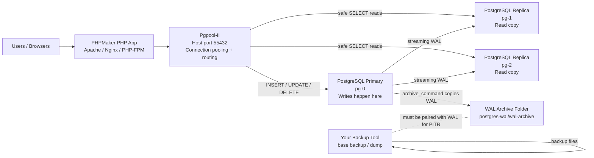
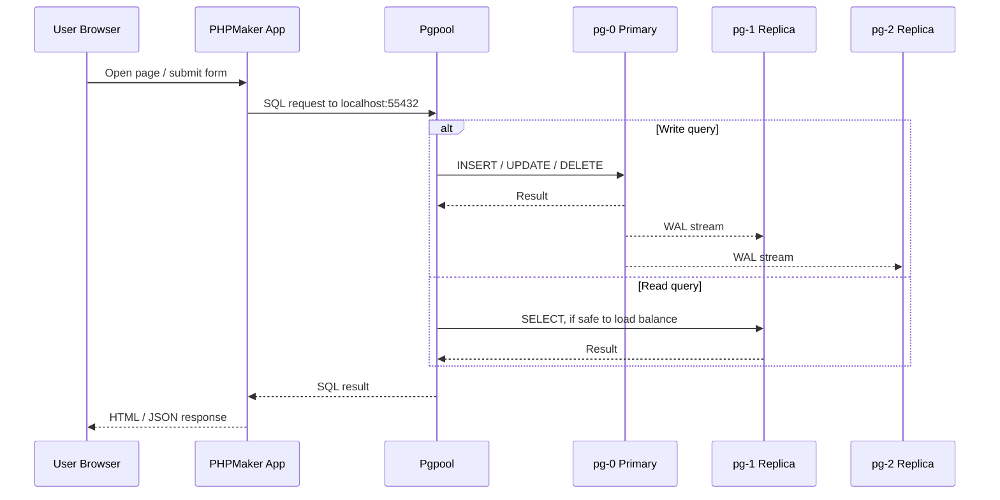
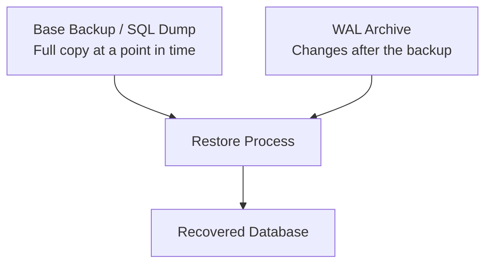
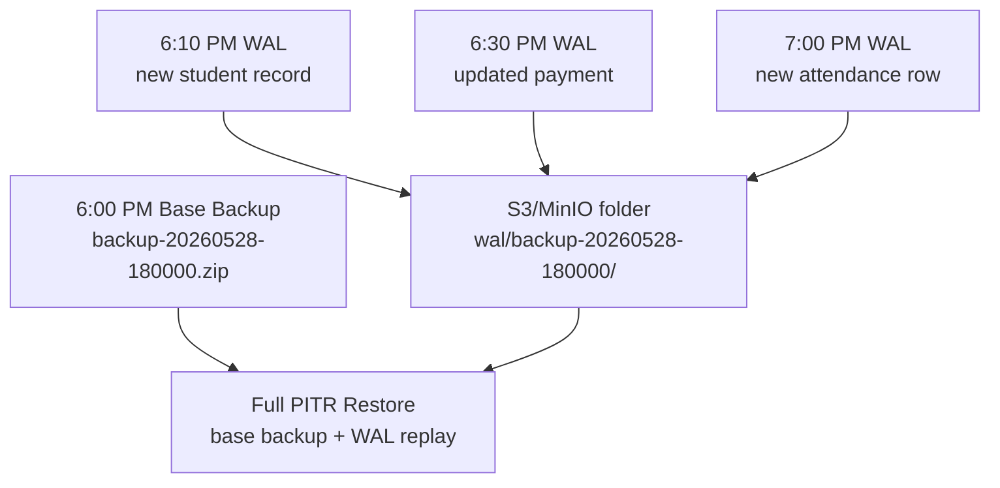
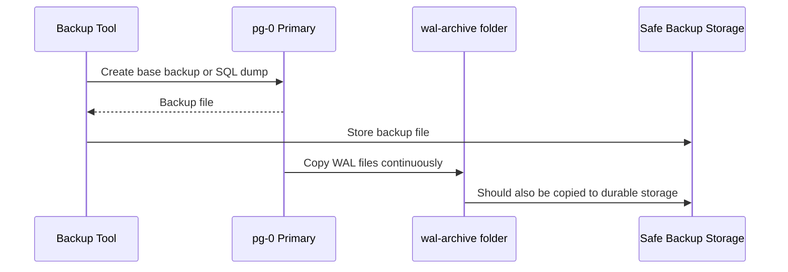
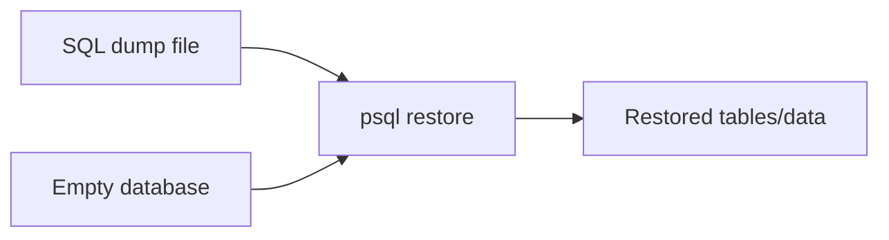
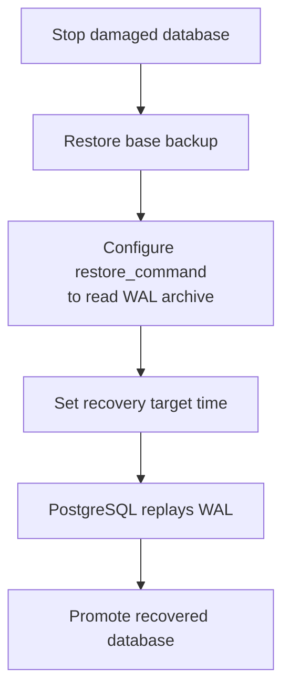

# PHPMaker App + PostgreSQL WAL Architecture

This explains what is happening when a PHPMaker application uses this `postgres-wal` database stack.

The short version:

- Your PHPMaker app connects to Pgpool on `localhost:55432`.
- Pgpool forwards writes to the primary PostgreSQL server.
- Pgpool can send safe read queries to replicas.
- PostgreSQL streams WAL records from the primary to replicas.
- WAL files are copied into `postgres-wal/wal-archive`.
- Your normal backup tool should still create base backups or dumps.
- Restore needs both a backup and, for point-in-time recovery, the WAL files.

## Simple Architecture



## What Is WAL?

WAL means Write-Ahead Log.

Think of WAL like a notebook where PostgreSQL writes every database change before it fully saves the change into the table files.

Example:

1. A PHPMaker user edits a student record.
2. PostgreSQL first writes the change into WAL.
3. PostgreSQL applies the change to the real table.
4. The replicas receive the same WAL.
5. The replicas replay the WAL so they become copies of the primary.
6. The WAL file is copied into `wal-archive` for recovery.

If the server crashes, PostgreSQL reads WAL to recover safely.

## Request Flow



## How Many Users Can It Cater?

There is no honest fixed number without testing your real PHPMaker app.

Capacity depends on:

- Server CPU and RAM.
- Disk speed, especially write latency.
- Query quality and indexes.
- Number of PHPMaker pages opened at the same time.
- Whether users are mostly reading or writing.
- Whether PHP opens too many database connections.
- How heavy your reports, joins, filters, and exports are.

### Practical Starting Estimate

For a small to medium server, this stack can usually support:

- Tens to hundreds of active users if pages are simple and indexed well.
- Hundreds to thousands of logged-in users if only a smaller portion are active at the same second.
- Thousands of requests per minute if queries are fast and connection pooling is configured correctly.

But if a PHPMaker page runs a slow report query, even 20 users can overload the database.

The right question is not only "how many users?".

The better questions are:

- How many users are active at the same second?
- How many SQL queries does one page load create?
- What is the slowest query?
- How many writes per second happen?
- How long can the app wait during failover?

## User Capacity Example Scenarios

### Scenario 1: Simple CRUD App

Example:

- Students table.
- Users mostly add/edit/search records.
- Good indexes on search fields.
- No heavy reports.

Expected behavior:

- This stack should handle many concurrent users well.
- Pgpool helps avoid direct overload on PostgreSQL.
- Replicas can help with read load.

Risk:

- If PHP opens too many connections, PostgreSQL can still be exhausted.

### Scenario 2: Heavy Reports

Example:

- PHPMaker page exports thousands of rows.
- Many joins.
- No indexes on filter fields.

Expected behavior:

- User count may drop sharply.
- Replicas help only if queries are routed as reads.
- Slow queries can still consume CPU, RAM, and disk.

Fix:

- Add indexes.
- Paginate.
- Avoid exporting huge reports during peak time.
- Cache reports if possible.

### Scenario 3: Many Writes

Example:

- Attendance system with many users submitting at the same time.
- Inventory updates.
- Payment or transaction records.

Expected behavior:

- Writes go to the primary only.
- Replicas do not multiply write capacity.
- WAL archive grows faster.

Fix:

- Use fast disk.
- Keep transactions short.
- Avoid unnecessary indexes on very hot write tables.
- Monitor WAL archive size.

### Scenario 4: Primary Container Fails

Example:

- `pg-0` stops.

Expected behavior:

- One replica can be promoted.
- Pgpool detects node status.
- The app may see temporary errors during failover.

Important:

- Your PHPMaker/PHP app should retry failed database requests.
- Do not assume failover means zero errors. It means the system can recover.

## Backup vs WAL Archive

Backup and WAL are different.



### Backup

A backup is a full copy of your data at a specific time.

Examples:

- `pg_dump`
- `pg_dumpall`
- `pg_basebackup`
- Your existing backup tool

If you only have a backup from 1:00 PM, then restoring only that backup returns the database to 1:00 PM.

### WAL Archive

WAL archive stores the changes after a backup.

If you have:

- Full backup from 1:00 PM.
- WAL files from 1:00 PM to 3:00 PM.

Then you can restore closer to 3:00 PM, or to a specific time like 2:37 PM.

This is called point-in-time recovery, or PITR.

## Daily Base Backup + WAL Folder Pattern

This stack now organizes WAL by backup generation.

Example:

```text
6:00 PM backup:
app-backup/base/backup-20260528-180000.zip

Changes after 6:00 PM:
app-backup/wal/backup-20260528-180000/0000000100000000000000A1
app-backup/wal/backup-20260528-180000/0000000100000000000000A2
```

Simple picture:



Important:

- The base backup is the starting point.
- WAL after that backup is the transaction story after the starting point.
- `/v1/wal/upload` uploads pending WAL to the active backup's folder.
- `/v1/pitr/chains` shows which backup and WAL folder belong together.
- `/v1/restores/run` restores only the SQL dump inside the ZIP. It does not replay WAL.
- Full PITR restore must be tested in a separate PostgreSQL restore instance.

## Backup Flow



Important:

- Do not store your only backup on the same machine forever.
- Copy backups and WAL archives to another disk, NAS, MinIO, S3, or cloud storage.
- Test restore regularly.

## Restore Flow

### Simple Restore From SQL Dump

Use this when:

- You have a `.sql` dump.
- You only need to restore to the dump time.

Simple idea:



General command shape:

```powershell
docker exec -i postgres-wal-pg-0 psql -U postgres -d appdb < backup.sql
```

### Point-In-Time Restore

Use this when:

- You need to restore to a specific time.
- You have a base backup.
- You have the WAL archive after that backup.

Simple idea:



Point-in-time recovery is more advanced than restoring a SQL dump. You should write and test a runbook before relying on it in production.

## What Happens If Something Fails?

### PHPMaker App Fails

Database may still be healthy.

Action:

- Restart PHP/Apache/Nginx.
- Check app logs.
- Database restore is usually not needed.

### Pgpool Fails

PostgreSQL may still be healthy, but the app entrypoint is down.

Action:

- Restart Pgpool.
- In production, run more than one Pgpool behind a load balancer.

### Primary PostgreSQL Fails

Replicas may still have the data.

Action:

- Failover promotes a replica.
- App may need reconnect/retry.
- Old primary must be rejoined carefully.

### Disk Is Full

This is dangerous.

Possible causes:

- WAL archive grows too much.
- Backups are never cleaned.
- Logs grow too much.

Action:

- Free space safely.
- Move old WAL/backups to archive storage.
- Never randomly delete recent WAL if you need PITR.

## How To Test Capacity

This repo includes a Go test tool:

```powershell
cd D:\TOOLS\DOCKER-DEV\postgres-wal\tests\go-postgres-wal
go run .
```

Run a bigger test:

```powershell
go run . -concurrency 100 -requests 1000
```

This does not perfectly simulate PHPMaker pages, but it checks:

- Pgpool connection.
- Concurrent SQL requests.
- Replication.
- WAL archive.
- Backup and restore round trip.

For real PHPMaker testing, use a load tool against your actual web pages:

- k6
- JMeter
- Locust
- ApacheBench for simple pages

Measure:

- Requests per second.
- Average response time.
- 95th percentile response time.
- Error rate.
- Database CPU/RAM.
- Slow queries.
- Connection count.
- Replication lag.

## Good PHPMaker Practices

- Use Pgpool host/port: `localhost:55432`.
- Do not connect PHPMaker directly to `pg-0`, `pg-1`, or `pg-2`.
- Add indexes for fields used in search, filters, joins, and sorting.
- Avoid loading huge result sets in one page.
- Use pagination.
- Avoid long transactions.
- Keep reports separate from normal CRUD if reports are heavy.
- Add retry handling for temporary database disconnects.
- Monitor slow queries.

## FAQ

### Is this "enterprise grade" already?

It is an enterprise-style reference stack.

For real enterprise production, run nodes on separate machines or availability zones. A single Docker host is still one point of failure.

### Can replicas increase write speed?

No.

Writes still go to the primary. Replicas help with reads and failover.

### Can this handle thousands of users?

Maybe, depending on what those users do.

Thousands of logged-in users is different from thousands of users clicking at the exact same second.

You must load test the real PHPMaker app.

### Why use Pgpool?

Pgpool gives the app one database address.

It can:

- Pool connections.
- Route traffic.
- Check backend health.
- Help with read balancing.

### Why not connect PHPMaker directly to the primary?

Direct primary connection works, but you lose the single HA entrypoint.

If the primary changes during failover, the app must know where to reconnect. Pgpool hides that complexity.

### Are WAL files the same as backups?

No.

WAL files are change logs. You still need a full backup or base backup.

### Can I delete old WAL files?

Only if you are sure you no longer need them for restore.

A safe cleanup policy depends on your backup retention policy.

Example:

- Keep daily backups for 14 days.
- Keep WAL needed to restore any retained backup.
- Move older backups/WAL to cheaper archive storage.

### How often should I test restore?

At least monthly for important systems.

Also test before going live and after changing backup configuration.

### What is the most common cause of poor performance?

Usually slow queries and missing indexes.

Connection overload is also common with PHP apps if connection pooling is not handled properly.

### What should I monitor?

Monitor:

- Database CPU.
- RAM.
- Disk free space.
- WAL archive size.
- Slow queries.
- Active connections.
- Replication lag.
- Failed backups.
- Failed WAL archiving.
- Pgpool health.

## Student-Friendly Analogy

Imagine the database is a school notebook system.

- Primary PostgreSQL is the main notebook where the teacher writes official records.
- Replicas are photocopies that are updated continuously.
- WAL is the teacher's rough logbook of every change.
- Backup is a full photocopy of the notebook at a certain time.
- Pgpool is the classroom assistant who decides where each question should go.

If the main notebook is damaged, you restore the last full photocopy, then replay the rough logbook until the exact moment you want.

That is why both backups and WAL are important.
