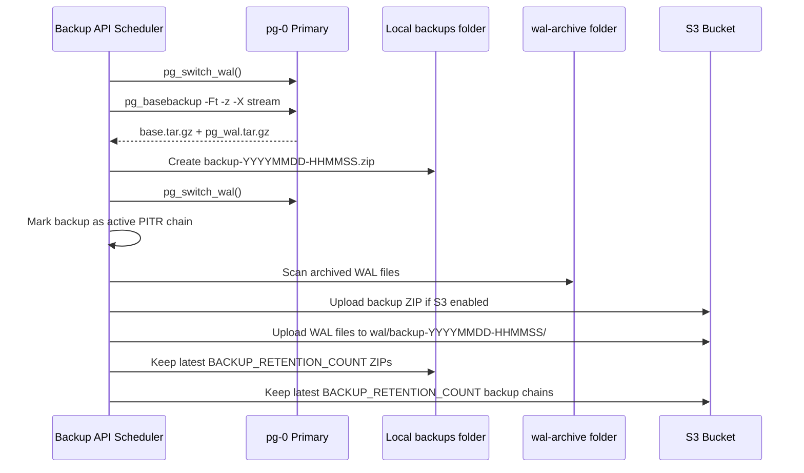
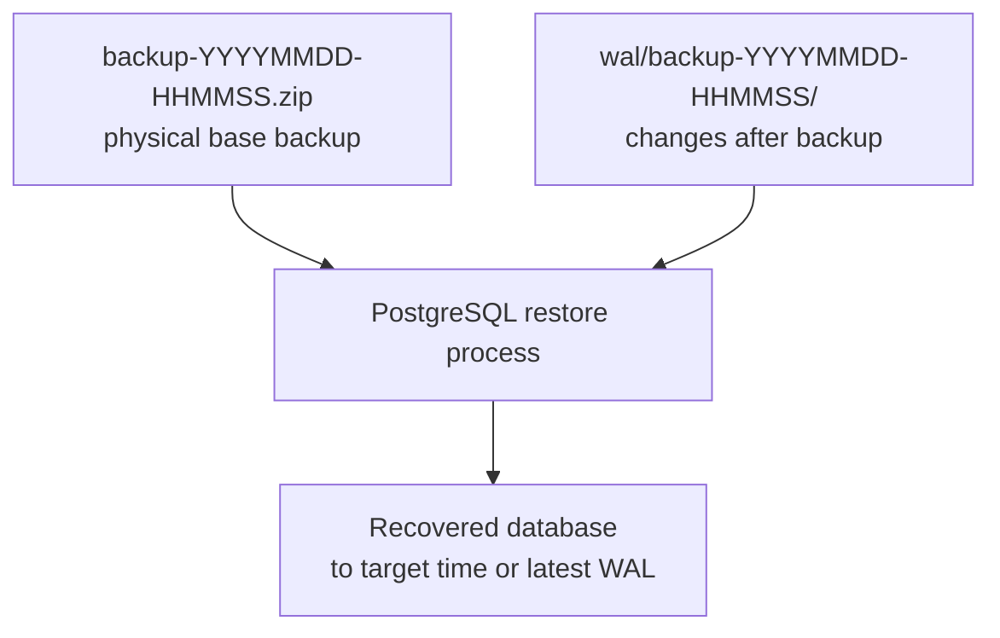

# Backup API, S3 Snapshots, WAL, and Restore

This stack now includes a `backup-api` service.

It does four jobs:

- Creates scheduled physical PostgreSQL backups using `pg_basebackup`.
- Wraps each backup into a ZIP file in `postgres-wal/backups`.
- Uploads backup ZIPs and the matching WAL chain to S3-compatible storage when enabled.
- Exposes authenticated HTTP endpoints with Swagger.

Swagger UI:

```text
http://localhost:8090/swagger
```

API authentication header:

```text
X-Backup-API-Key: value of BACKUP_API_KEY
```

## Environment Settings

Settings live in the root file:

```text
postgres-wal.env
```

Important backup settings:

```env
BACKUP_API_HOST_PORT=8090
BACKUP_API_KEY=change-backup-api-key
BACKUP_SCHEDULE_ENABLED=true
BACKUP_DAILY_TIME=02:00
BACKUP_TIMEZONE=Asia/Manila
BACKUP_RETENTION_COUNT=7
```

S3 settings:

```env
BACKUP_S3_ENABLED=false
BACKUP_S3_ENDPOINT=
BACKUP_S3_REGION=us-east-1
BACKUP_S3_BUCKET=
BACKUP_S3_PREFIX=postgres-wal
BACKUP_S3_ACCESS_KEY_ID=
BACKUP_S3_SECRET_ACCESS_KEY=
BACKUP_S3_FORCE_PATH_STYLE=true
```

For AWS S3:

```env
BACKUP_S3_ENABLED=true
BACKUP_S3_ENDPOINT=
BACKUP_S3_REGION=ap-southeast-1
BACKUP_S3_BUCKET=my-postgres-backups
BACKUP_S3_PREFIX=postgres-wal-prod
BACKUP_S3_ACCESS_KEY_ID=your-access-key
BACKUP_S3_SECRET_ACCESS_KEY=your-secret-key
BACKUP_S3_FORCE_PATH_STYLE=false
```

For MinIO or S3-compatible storage:

```env
BACKUP_S3_ENABLED=true
BACKUP_S3_ENDPOINT=http://minio:9000
BACKUP_S3_REGION=us-east-1
BACKUP_S3_BUCKET=postgres-backups
BACKUP_S3_PREFIX=postgres-wal-dev
BACKUP_S3_ACCESS_KEY_ID=minio-user
BACKUP_S3_SECRET_ACCESS_KEY=minio-password
BACKUP_S3_FORCE_PATH_STYLE=true
```

## Proper Daily Backup + WAL Chain



The daily backup becomes the safe restore point. WAL files after that backup are uploaded into that backup's own folder.

Student analogy:

- The base backup is a full photocopy at 6:00 PM.
- WAL files are the new pages written after 6:00 PM.
- The API keeps the new pages in the folder for that photocopy.
- During full PITR restore, PostgreSQL starts from the photocopy and replays the new pages.

## What Is Stored?

Local backup ZIPs:

```text
postgres-wal/backups/backup-YYYYMMDD-HHMMSS.zip
```

Local WAL archive:

```text
postgres-wal/wal-archive
```

S3 layout when enabled:

```text
s3://BUCKET/PREFIX/base/backup-YYYYMMDD-HHMMSS.zip
s3://BUCKET/PREFIX/wal/backup-YYYYMMDD-HHMMSS/0000000100000000000000A1
s3://BUCKET/PREFIX/wal/backup-YYYYMMDD-HHMMSS/0000000100000000000000A2
```

Older objects directly under `PREFIX/wal/000...` may exist if they were uploaded by an older API version. New uploads are organized under `PREFIX/wal/<backup-id>/`.

## Retention and Why WAL Is Not Blindly Deleted

Backup ZIP retention is safe:

```env
BACKUP_RETENTION_COUNT=7
```

That means the service keeps only the newest 7 backup ZIPs locally and in S3.

WAL retention is different. WAL files may be needed to restore one of those backups to a later time. Deleting WAL too aggressively can break point-in-time recovery.

Current API rule:

- Every new base backup creates a new PITR chain.
- `/v1/wal/upload` uploads new WAL into the active chain folder.
- S3 WAL folders are pruned only when their base backup generation leaves `BACKUP_RETENTION_COUNT`.
- Local `wal-archive` files are not deleted by the API because PostgreSQL and retained backups may still need them.

Recommended production rule:

- Keep local WAL only as a short buffer.
- Keep S3/MinIO WAL at least as long as your oldest retained backup.
- Add MinIO or S3 lifecycle cleanup after you are confident your restore tests work.

## Manual API Commands

PowerShell header:

```powershell
$headers = @{ "X-Backup-API-Key" = "change-backup-api-key" }
```

Check service status:

```powershell
Invoke-RestMethod -Uri http://localhost:8090/v1/status -Headers $headers
```

Check database status:

```powershell
Invoke-RestMethod -Uri http://localhost:8090/v1/database/status -Headers $headers
```

Run backup now:

```powershell
Invoke-RestMethod -Method Post -Uri http://localhost:8090/v1/backups/run -Headers $headers
```

This creates:

```text
postgres-wal/backups/backup-YYYYMMDD-HHMMSS.zip
s3://BUCKET/PREFIX/base/backup-YYYYMMDD-HHMMSS.zip
s3://BUCKET/PREFIX/wal/backup-YYYYMMDD-HHMMSS/
```

List local backups:

```powershell
Invoke-RestMethod -Uri http://localhost:8090/v1/backups -Headers $headers
```

List backups that can be restored into a database:

```powershell
Invoke-RestMethod -Uri http://localhost:8090/v1/restores/options -Headers $headers
```

Restore a backup into a new test database:

```powershell
$body = @{
  backup_name = "backup-YYYYMMDD-HHMMSS.zip"
  target_database = "appdb_restore_test"
  drop_if_exists = $true
} | ConvertTo-Json

Invoke-RestMethod -Method Post -Uri http://localhost:8090/v1/restores/run -Headers $headers -ContentType "application/json" -Body $body
```

Important restore rule:

```text
Database-level restore only works for backup ZIPs created after this restore feature was added.
Those ZIPs contain logical/appdb.sql.
Older physical-only ZIPs are still useful for full-cluster PITR, but cannot be restored into a new database by this endpoint.
```

Check WAL status:

```powershell
Invoke-RestMethod -Uri http://localhost:8090/v1/wal/status -Headers $headers
```

Check uploaded S3 objects:

```powershell
Invoke-RestMethod -Uri http://localhost:8090/v1/s3/status -Headers $headers
```

Upload pending WAL files:

```powershell
Invoke-RestMethod -Method Post -Uri http://localhost:8090/v1/wal/upload -Headers $headers
```

List PITR chains:

```powershell
Invoke-RestMethod -Uri http://localhost:8090/v1/pitr/chains -Headers $headers
```

This tells you which base backup belongs to which WAL folder.

For your MinIO archive setup, open the console on port `9011`, then browse:

```text
bucket: postgres-wal
base backups: app-backup/base
WAL files: app-backup/wal/<backup-id>
```

Do not use port `9010` in the browser for the console. Port `9010` is the S3 API endpoint used by the backup service.

## Restore Concept

There are two restore styles. They are not the same.

## Restore Style 1: Database-Level Test Restore

Use this endpoint:

```text
POST /v1/restores/run
```

This restore:

- Creates a new database like `appdb_restore_test`.
- Restores `logical/appdb.sql` from the selected backup ZIP.
- Does not replay WAL.
- Does not replace the running HA cluster.

This is the safe way to check if a backup ZIP is readable.

Example:

```powershell
$body = @{
  backup_name = "backup-20260528-180000.zip"
  target_database = "appdb_restore_test"
  drop_if_exists = $true
} | ConvertTo-Json

Invoke-RestMethod -Method Post -Uri http://localhost:8090/v1/restores/run -Headers $headers -ContentType "application/json" -Body $body
```

If you add new data after `backup-20260528-180000.zip`, this database-level restore will not show the new data. That is expected because SQL restore uses only the dump inside the ZIP.

## Restore Style 2: Full PITR Restore With WAL Replay

To restore to the most current possible state after a base backup, you need:

- A base backup ZIP.
- That backup's WAL folder.



High-level restore process:

1. Choose a chain from `/v1/pitr/chains`.
2. Create a separate restore PostgreSQL instance. Do not test PITR on production first.
3. Download the selected `base/backup-YYYYMMDD-HHMMSS.zip`.
4. Download or expose the matching `wal/backup-YYYYMMDD-HHMMSS/` folder.
5. Unzip the base backup.
6. Restore the physical PostgreSQL data files from the backup.
7. Configure PostgreSQL `restore_command` so it can read WAL from the matching WAL folder.
8. Set a recovery target time if you want a specific time.
9. Start PostgreSQL and let it replay WAL.
10. Promote the recovered database.

This repository now prepares the correct ingredients. A production restore should still be tested in a separate restore environment before an emergency.

## Restore Lab Commands

This repo includes a separate restore lab so you can test PITR without touching the running HA stack.

It uses:

```text
compose file: postgres-wal/docker-compose.restore.yml
restore port: 55433
container: postgres-wal-pitr-restore
```

Step by step:

```powershell
cd D:\TOOLS\DOCKER-DEV\postgres-wal

$headers = @{ "X-Backup-API-Key" = "change-backup-api-key" }
Invoke-RestMethod -Uri http://localhost:8090/v1/pitr/chains -Headers $headers | ConvertTo-Json -Depth 8

.\restore-lab\prepare-pitr-restore.ps1 -BackupName backup-YYYYMMDD-HHMMSS.zip

docker compose -f docker-compose.restore.yml --env-file ..\postgres-wal.env down -v
docker compose -f docker-compose.restore.yml --env-file ..\postgres-wal.env up -d

docker logs -f postgres-wal-pitr-restore
```

Verify:

```powershell
docker exec -e PGPASSWORD=0yq5h3to9 postgres-wal-pitr-restore psql -U appuser -d appdb -c "select current_database(), current_user, now();"
```

Optional target time:

```powershell
.\restore-lab\prepare-pitr-restore.ps1 -BackupName backup-YYYYMMDD-HHMMSS.zip -RecoveryTargetTime "2026-05-28 18:30:00+08"
```

Read [restore-lab/README.md](restore-lab/README.md) for the full runbook.

## Common Scenario: 6 PM Backup, New Data, Then Restore

Example:

1. At 6:00 PM, the scheduler creates `backup-20260528-180000.zip`.
2. The API marks `backup-20260528-180000` as the active PITR chain.
3. Users add new records at 6:10 PM, 6:30 PM, and 7:00 PM.
4. PostgreSQL writes those changes into WAL.
5. You call `/v1/wal/upload`, or schedule it frequently.
6. The API uploads pending WAL to `app-backup/wal/backup-20260528-180000/`.
7. If you call `/v1/restores/run`, you restore only the 6:00 PM SQL dump.
8. If you perform full PITR, PostgreSQL restores the 6:00 PM base backup and replays the WAL after 6:00 PM.

Answer to the common confusion:

```text
POST /v1/restores/run does not replay WAL.
Full PITR restore replays WAL, but it must be done in a separate PostgreSQL restore instance.
```

## Suggested Schedule

Use this simple setup first:

- Run one base backup daily during low traffic, for example `18:00`.
- Run `/v1/wal/upload` every 5 to 15 minutes.
- Keep `BACKUP_RETENTION_COUNT=7` until you know your storage usage.
- Test `/v1/restores/run` after every important change.
- Test full PITR at least monthly in a separate restore stack.

For Windows Task Scheduler or another scheduler, call:

```powershell
$headers = @{ "X-Backup-API-Key" = "change-backup-api-key" }
Invoke-RestMethod -Method Post -Uri http://localhost:8090/v1/wal/upload -Headers $headers
```

## Endpoint Summary

Important endpoints:

- `GET /v1/status` checks backup API status.
- `GET /v1/database/status` checks PostgreSQL connection and archiver status.
- `POST /v1/backups/run` creates a new base backup and active PITR chain.
- `POST /v1/wal/upload` uploads pending WAL to the active PITR chain.
- `GET /v1/pitr/chains` shows which base backup and WAL folder belong together.
- `GET /v1/s3/status` shows recent S3/MinIO objects.
- `GET /v1/restores/options` lists ZIP files usable by the database-level restore endpoint.
- `POST /v1/restores/run` restores only the logical SQL dump into a new database.

Open Swagger for the same list:

```text
http://localhost:8090/swagger
```

## Important Notes

- `pg_basebackup -X stream` includes WAL required to make the base backup consistent.
- The continuous `wal-archive` folder gives you changes after the backup.
- S3 upload is optional but strongly recommended.
- Do not store your only backup on the same Docker host.
- Test restore before trusting the backup.
- Rotate `BACKUP_API_KEY` like any other secret.
