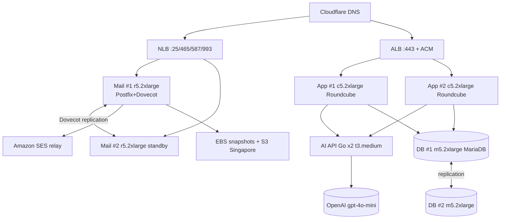

# MONTHLY COST PROPOSAL
## Email Hosting Platform with AI Integration
**itbsstudio.com · 10,000 Users · AWS Manila Local Zone (`ap-southeast-1-mnl-1`)**

| | |
|---|---|
| **Prepared for** | itbsstudio.com / ITBS |
| **Platform** | ITBS Mail — Docker Mailserver + Roundcube + AI Assistant |
| **Region** | AWS Asia Pacific (Singapore) — **Manila Local Zone** `ap-southeast-1-mnl-1` |
| **Scale** | 10,000 mailboxes |
| **Date** | June 2026 |
| **Currency** | USD (AWS bills in USD; indicative PHP at ₱57/USD) |

> **Pricing basis.** EC2 and EBS rates below are the published on‑demand rates for the **Manila Local Zone** as of June 2026 (source: AWS pricing data, `aws-pricing.com/ap-southeast-1-mnl-1`). Local Zones carry a price premium over the parent Singapore region — notably **EBS gp2 is ~$0.222/GB‑month** in Manila vs ~$0.12 in Singapore. **All figures must be confirmed in the AWS Pricing Calculator before contract.** This is a planning estimate, not a quote.

---

## 1. Executive Summary

This proposal sizes and prices your existing containerized mail stack — **Docker Mailserver (Postfix/Dovecot), Roundcube webmail, MariaDB, the Go AI API, and the Go/React mail‑admin UI** — for production operation at **10,000 mailboxes** on the **AWS Manila Local Zone**, which keeps data and latency inside the Philippines (relevant for the Data Privacy Act of 2012 and user experience).

Three sizing tiers are offered. The headline figure is the **Recommended (HA)** tier.

| Tier | Architecture | Mail storage | Est. monthly (USD) | Indicative PHP |
|---|---|---|---|---|
| **Lean** | Single app + single mail/DB node, **no HA** | ~12 TB | **≈ $6,200** | ≈ ₱353,000 |
| **Recommended (HA)** ⭐ | Redundant app, mail, DB nodes | ~15 TB | **≈ $9,100** on‑demand / **≈ $8,000** with 1‑yr Savings Plan | ≈ ₱456,000–518,000 |
| **Premium** | Full HA + generous 5 GB/user quota | ~50 TB | **≈ $22,000** | ≈ ₱1,255,000 |

> **Storage is the largest single cost driver** (~40% of the Recommended tier) because of the Local Zone EBS premium. Section 6 lists concrete levers (tiering cold mail/backups to the Singapore region, right‑sizing quotas, gp3) that can cut storage cost 30–60%.

Compute and platform costs are largely fixed; **storage and AI scale with usage**. A 1‑year Compute Savings Plan reduces compute ~35% with no architecture change.

---

## 2. What We Are Hosting (mapping your stack to AWS)

| Component (your repo) | Role | AWS placement |
|---|---|---|
| `docker-mailserver` (Postfix + Dovecot) | SMTP in/out, IMAP, anti‑spam | **Mail nodes** (memory‑optimized r5) |
| `roundcube` (PHP‑FPM + nginx) + `itbs_ai_assistant` plugin | Webmail UI | **App nodes** (compute‑optimized c5), behind ALB |
| `mariadb:11` | Roundcube metadata / sessions | **DB nodes** (general‑purpose m5) |
| `ai-api` (Go) | AI proxy → OpenAI `gpt-4o-mini` | **AI nodes** (t3) or co‑located on app nodes |
| `mail-admin` (Go + React) | Mailbox admin (add/reset/quota) | Co‑located (private, IP‑allowlisted) |
| Outbound delivery | Deliverability / port 25 reputation | **Amazon SES relay** (recommended) |

> **Migration note.** Your current `docker-compose.yml` runs every service on one host. At 10k users the roles are split across instances for capacity and HA. The same images and `remote.env` model are reused per role (split compose files, Docker Swarm, or ECS on EC2 in the Local Zone).

---

## 3. Recommended Architecture (HA)

```
                          Internet (Cloudflare DNS / proxy)
                                       │
              ┌────────────────────────┼─────────────────────────┐
              │ MX / SMTP / IMAPS       │ HTTPS (webmail)         │
              ▼                         ▼                         │
     ┌──────────────────┐      ┌──────────────────┐              │
     │  NLB (mail :25/   │      │  ALB (:443)      │              │
     │  :465/:587/:993)  │      │  ACM TLS         │              │
     └────────┬─────────┘       └────────┬─────────┘              │
              │                          │                        │
   ┌──────────┴──────────┐     ┌─────────┴──────────┐             │
   ▼                     ▼     ▼                     ▼             │
┌─────────┐         ┌─────────┐  ┌──────────┐   ┌──────────┐      │
│ Mail #1 │◀──repl──▶│ Mail #2 │  │  App #1  │   │  App #2  │      │
│ r5.2xl  │         │ r5.2xl   │  │ c5.2xl   │   │ c5.2xl   │      │
│ Postfix │         │ standby  │  │Roundcube │   │Roundcube │      │
│ Dovecot │         └─────────┘  └────┬─────┘   └────┬─────┘      │
└────┬────┘                            │              │           │
     │ EBS mail store (gp2)            └──────┬───────┘           │
     │                                        ▼                   │
     │                              ┌──────────────────┐          │
     │                              │  AI API (Go) x2   │── OpenAI │
     │                              │  t3.medium        │  gpt-4o  │
     │                              └────────┬─────────┘  -mini    │
     ▼                                       ▼                     │
┌──────────────────────────────────────────────────┐             │
│  DB #1 (m5.2xl, MariaDB)  ◀── repl ──▶  DB #2      │             │
└──────────────────────────────────────────────────┘             │
                                                                  │
  Outbound mail ──▶ Amazon SES relay (DKIM/SPF/DMARC, deliverability)
  Backups ──▶ EBS snapshots + S3 (Singapore region)  ◀────────────┘
  Ops ──▶ Bastion / CloudWatch (t3.medium)
```



### 3.1 Sizing rationale for 10,000 mailboxes

- **Concurrency assumption:** 10–20% of mailboxes active at peak → **~1,000–2,000 concurrent** webmail/IMAP sessions.
- **Mail nodes (r5.2xlarge, 8 vCPU / 64 GB):** Dovecot/Postfix scale well past 10k mailboxes on one well‑provisioned node; the constraint is RAM for IMAP connections + index cache, plus storage. A second node provides warm standby via Dovecot replication.
- **App nodes (c5.2xlarge, 8 vCPU / 16 GB ×2):** PHP‑FPM is CPU‑bound; two nodes behind an ALB cover the concurrent webmail load with room to add nodes on demand.
- **DB nodes (m5.2xlarge, 8 vCPU / 32 GB):** Roundcube DB is metadata/session‑heavy but modest in volume; primary + replica for HA.
- **AI API (t3.medium ×2):** the Go service is a lightweight proxy to OpenAI; CPU/RAM needs are small. Burstable t3 with two instances is sufficient.

---

## 4. Manila Local Zone — Instance & Storage Reference

On‑demand rates used in this proposal (Manila LZ, June 2026; **verify before contract**):

| Instance | vCPU | RAM (GB) | $/hour | $/month (730 h) |
|---|---|---|---|---|
| t3.medium | 2 | 4 | 0.0634 | 46.28 |
| t3.xlarge | 4 | 16 | 0.2534 | 184.98 |
| c5.2xlarge | 8 | 16 | 0.470 | 343.10 |
| c5.4xlarge | 16 | 32 | 0.941 | 686.93 |
| m5.2xlarge | 8 | 32 | 0.576 | 420.48 |
| r5.2xlarge | 8 | 64 | 0.730 | 532.90 |
| r5.4xlarge | 16 | 128 | 1.459 | 1,065.07 |
| g4dn.2xlarge (GPU) | 8 | 32 | 1.368 | 998.64 |

| Storage / service | Manila LZ rate | Notes |
|---|---|---|
| EBS **gp2** | **$0.222 / GB‑month** | Local Zone premium (~1.85× Singapore). Confirm gp3 availability — usually cheaper. |
| EBS snapshots → S3 | ~$0.05 / GB‑month | Billed in parent region |
| S3 Standard (Singapore) | ~$0.025 / GB‑month | For backups / cold mail tiering |
| Data transfer out | ~$0.09 / GB | After free tier |
| Public IPv4 (EIP) | ~$0.005 / hr (~$3.65/mo each) | Charged even when attached |
| Amazon SES | $0.10 / 1,000 emails | + ~$0.12/GB attachment data |
| OpenAI `gpt-4o-mini` | ~$0.15 /1M input, $0.60 /1M output tokens | Usage‑based, billed by OpenAI (not AWS) |

> **Available families in Manila LZ:** t3, c5, m5, r5, g4dn (12 instance types total). Larger/HA‑managed services (e.g. managed RDS, ElastiCache) are **not guaranteed** in the Local Zone — this design self‑manages MariaDB on EC2, consistent with your container stack. Services unavailable in the LZ can run from the parent Singapore region with added latency.

---

## 5. Detailed Monthly Cost — Recommended (HA) Tier

### 5.1 Compute

| Role | Instance | Qty | $/mo each | Subtotal |
|---|---|---:|---:|---:|
| Webmail / App | c5.2xlarge | 2 | 343.10 | 686.20 |
| Mail (primary + standby) | r5.2xlarge | 2 | 532.90 | 1,065.80 |
| Database (primary + replica) | m5.2xlarge | 2 | 420.48 | 840.96 |
| AI API | t3.medium | 2 | 46.28 | 92.56 |
| Bastion / monitoring | t3.medium | 1 | 46.28 | 46.28 |
| **Compute subtotal (on‑demand)** | | | | **2,731.80** |
| *With 1‑yr Compute Savings Plan (~35% off)* | | | | *≈ 1,780* |

### 5.2 Storage (EBS gp2 @ $0.222/GB‑month)

| Volume | Size | Subtotal |
|---|---|---:|
| OS / root (9 instances × 50 GB) | 450 GB | 99.90 |
| Database data (primary + replica, 2 × 500 GB) | 1,000 GB | 222.00 |
| **Mail store** (single copy; standby restored from snapshot) | **15,000 GB (~15 TB)** | **3,330.00** |
| **Storage subtotal** | | **3,651.90** |

> Mail store sized to **realistic year‑1 usage (~1.5 GB/active mailbox)** under a 2 GB/user offered quota, provisioned‑as‑you‑grow. See Section 7 for full‑quota scenarios.

### 5.3 Platform & operations

| Item | Basis | Subtotal |
|---|---|---:|
| Backups (EBS snapshots + S3 offsite, ~18 TB effective) | $0.05/GB blended | 750.00 |
| Data transfer out | ~3 TB/mo @ $0.09 | 300.00 |
| Load balancers (ALB + NLB + LCUs) | | 80.00 |
| Public IPv4 (EIPs for mail/PTR) | ~5 addresses | 20.00 |
| CloudWatch / logs / alarms | | 100.00 |
| Amazon SES outbound relay | ~3M external emails/mo | 350.00 |
| **Platform subtotal** | | **1,600.00** |

### 5.4 AI usage (OpenAI `gpt-4o-mini`)

| Assumption | Value |
|---|---|
| Active AI users | ~3,000 (30% of 10k) |
| AI actions/user/month | ~30 (compose, reply, summarize, translate, phishing, ask) |
| Avg tokens/action | ~2,000 in / 500 out |
| **Estimated cost** | **≈ $300/mo** (band: $150–$500; scales with adoption) |

### 5.5 Support

| Item | Basis | Subtotal |
|---|---|---:|
| AWS Business Support | 10% of first $10k AWS spend | ≈ 800.00 |

### 5.6 Recommended tier — total

| Cost group | On‑demand | With 1‑yr Savings Plan |
|---|---:|---:|
| Compute | 2,731.80 | 1,780.00 |
| Storage | 3,651.90 | 3,651.90 |
| Platform & ops | 1,600.00 | 1,600.00 |
| AI (OpenAI) | 300.00 | 300.00 |
| AWS Business Support | 800.00 | 703.00 |
| **TOTAL / month** | **≈ $9,084** | **≈ $8,035** |
| *Indicative PHP (₱57/USD)* | *≈ ₱517,800* | *≈ ₱458,000* |

---

## 6. Cost Optimization Levers

| Lever | Saving | Trade‑off |
|---|---|---|
| **1‑yr / 3‑yr Compute Savings Plan or Reserved Instances** | Compute −35% to −55% | Commitment term |
| **Tier cold mail + backups to S3 Singapore** ($0.025 vs $0.222/GB) | Storage −50–75% on archived data | Added latency for old mail; integration work (Dovecot S3/obox or archival job) |
| **Confirm & use EBS gp3 if available in LZ** | Storage −10–25% vs gp2 | Verify availability |
| **Right‑size quotas** (e.g. 2 GB standard, paid tiers above) | Linear with TB | Policy/comms with users |
| **Snapshot‑based standby instead of live replica** (already assumed for mail) | Avoids doubling mail storage | Slower failover (restore time) |
| **Single DB node for non‑critical phases** | −$420/mo | No DB HA |
| **Amazon SES vs self‑hosted outbound** | Avoids dedicated‑IP warmup, improves deliverability | $0.10/1k emails |

---

## 7. Storage Scenarios (10,000 mailboxes)

Mail storage is the dominant variable. Costs below are **mail store only**, EBS gp2 @ $0.222/GB‑month:

| Offered quota | Provisioned (realistic) | Mail store $/mo | If tiered to S3 Singapore* |
|---|---|---:|---:|
| 2 GB/user | ~15 TB (year‑1 actual) | $3,330 | ~$1,200–1,800 |
| 2 GB/user | 20 TB (full quota) | $4,440 | ~$1,600–2,400 |
| 3 GB/user | 30 TB | $6,660 | ~$2,400–3,600 |
| 5 GB/user | 50 TB | $11,100 | ~$4,000–6,000 |

\* *Hot (recent) mail stays on fast LZ EBS; cold mail moves to S3. Indicative blended range.*

---

## 8. Tier Comparison

| | **Lean** | **Recommended (HA)** ⭐ | **Premium** |
|---|---|---|---|
| App nodes | 1 × c5.2xlarge | 2 × c5.2xlarge | 2 × c5.4xlarge |
| Mail nodes | 1 (in r5.4xlarge combined) | 2 × r5.2xlarge | 2 × r5.4xlarge |
| DB | on mail node | 2 × m5.2xlarge | 2 × r5.2xlarge |
| AI nodes | shared | 2 × t3.medium | 2 × t3.xlarge |
| High availability | ❌ none | ✅ app/mail/DB | ✅ full + headroom |
| Mail storage | ~12 TB | ~15 TB | ~50 TB (5 GB/user) |
| **Est. monthly (USD)** | **≈ $6,200** | **≈ $9,100** (≈ $8,000 w/ Savings Plan) | **≈ $22,000** |

> **Lean** is suitable for pilot/soft‑launch; a single mail/DB node means maintenance and failures cause downtime. **Recommended** is the production baseline. **Premium** suits SLA‑backed, generous‑quota deployments (apply storage tiering to reduce the ~$11.7k storage line).

---

## 9. Setup & Deployment Plan

**Phase 0 — Prerequisites (Week 1)**
- AWS account; **opt in to the Manila Local Zone** (`ap-southeast-1-mnl-1`).
- DNS at Cloudflare per `docs/AWS_CLOUDFLARE_DNS_SETUP.md`.
- Amazon SES: production access, domain verification, **DKIM/SPF/DMARC** records.
- Request **port 25 unblock** (or send exclusively via SES) and **reverse DNS (PTR)** for mail EIP.

**Phase 1 — Network**
- VPC with subnets in the Local Zone; security groups (25/465/587/993/443 public, admin/DB private); NAT; allocate EIPs.

**Phase 2 — Compute & stack deployment**
- Launch EC2 per Section 3; install Docker.
- Split the existing compose into per‑role deployments (compose files, Swarm, or ECS‑on‑EC2) using the `remote.env` model.
- App nodes pull the Roundcube image + `itbs_ai_assistant` plugin; AI nodes run `ai-api` with `OPENAI_API_KEY` set; mail nodes run `docker-mailserver`.

**Phase 3 — Storage & data**
- Attach and mount EBS mail store on mail nodes; DB data volumes on DB nodes; set up MariaDB primary/replica and Dovecot replication.

**Phase 4 — TLS & DNS for mail**
- ACM certificate on the ALB for webmail; Let's Encrypt (per `remote.env`) or ACM for mail TLS.
- Publish **MX, SPF, DKIM, DMARC**; verify PTR.

**Phase 5 — HA & backups**
- Nightly **EBS snapshots** (incremental) + offsite **S3 (Singapore)** copy of mail + DB dumps.
- Document failover runbook (standby promotion, snapshot restore).

**Phase 6 — Monitoring**
- CloudWatch metrics/alarms (CPU, disk, queue depth, IMAP connections, ALB health), log shipping, mail‑queue alerts.

**Phase 7 — Load test, migration & go‑live**
- Load test webmail + IMAP at target concurrency.
- Migrate existing mailboxes via IMAP sync (`imapsync`) where applicable.
- Staged cutover; monitor deliverability and reputation.

---

## 10. Assumptions, Exclusions & Risks

**Assumptions**
- 10,000 mailboxes; 10–20% peak concurrency; 2 GB/user standard quota.
- Outbound delivery via Amazon SES (recommended for deliverability).
- AI adoption ~30% of users at moderate intensity.
- 730 hours/month; on‑demand unless a Savings Plan is noted.

**Excluded from monthly figures**
- **One‑time professional services**: architecture, deployment, data migration, load testing, hardening (quoted separately).
- Domain registration, third‑party security tooling, premium anti‑spam/AV licensing.
- OpenAI spend is billed directly by OpenAI (shown as an estimate, not on the AWS invoice).
- VAT/withholding tax and FX movement.

**Risks / notes**
- **Local Zone pricing & service availability must be verified** in the AWS Pricing Calculator; EBS gp2 rate ($0.222/GB‑mo) is from a third‑party snapshot.
- **Email deliverability** depends on IP reputation, PTR, and authentication — SES is strongly recommended over self‑hosted port‑25 sending.
- **Storage growth** is the main budget risk; enforce quotas and review tiering quarterly.
- **Data residency:** Manila LZ keeps primary data in the Philippines (supports PH Data Privacy Act compliance); backups in Singapore should be assessed against your data‑residency policy.

---

## 11. Headline Numbers

| | On‑demand | With 1‑yr Savings Plan |
|---|---:|---:|
| **Recommended (HA) — monthly** | **≈ $9,100 USD** | **≈ $8,000 USD** |
| *Indicative PHP @ ₱57/USD* | *≈ ₱518,000* | *≈ ₱456,000* |
| **Annualized** | ≈ $109,000 | ≈ $96,000 |

> Figures are planning estimates for budgeting. A firm quote requires confirming Manila Local Zone rates, final quota policy, and Savings Plan term in the AWS Pricing Calculator.

---
*Prepared from the ITBS Mail stack (`docker-compose.yml`, `remote.env.example`) and AWS Manila Local Zone pricing data, June 2026.*
